# TaxTrace — AI Compliance Execution Platform

> **AI prepares. Evidence explains. CA approves.**

TaxTrace is an evidence-first compliance execution platform for small Indian CA firms. Its current pilot baseline combines deterministic GST reconciliation, evidence-grounded AI assistance, notice drafting, task workflows, and a Next.js review interface.

## Current status

**Current milestone: Phase 1 — Pilot-Ready Baseline.**

This is a **controlled-pilot application**, not a production tax/legal decision-maker.

| Capability | Status |
|---|---|
| FastAPI backend | Implemented |
| Next.js 16 / React 19 frontend | Implemented |
| Tenant-aware domain model | Implemented |
| JWT authentication / role permissions | Implemented |
| Purchase Register + GSTR-2B ingestion | Implemented for CSV/JSON |
| Deterministic reconciliation | Implemented |
| Exception review workflow | Implemented |
| Evidence-grounded AI explanations | Implemented with mock provider in verification |
| Notice extraction / draft workflow | Implemented within pilot/mock boundaries |
| Tasks / dashboard / follow-up | Implemented |
| Knowledge/RAG API surface | Implemented; production ingestion/provider scope remains limited |
| WhatsApp channel abstraction / simulator | Implemented |
| PostgreSQL / Alembic path | Implemented in repository; deployment hardening remains |
| Controlled pilot readiness | **Documented as complete** |
| Production deployment | **Not claimed** |
| External security review | Pending |
| Production AI provider + cost controls | Pending |
| Staging / observability / backup validation | Pending |

## Product principle

TaxTrace deliberately separates:

```text
Input
  ↓
Validate
  ↓
Extract / Normalize
  ↓
Deterministic processing
  ↓
Retrieve evidence
  ↓
AI assistance
  ↓
Verify
  ↓
CA approval
  ↓
Audit trail
```

The reconciliation engine does not delegate financial truth to an LLM.

## System architecture

The current repository architecture is shown below. It maps the review interface, FastAPI platform services, deterministic reconciliation path, notice/AI workflow, firm workflows, WhatsApp channel abstraction, and audit trail to their implementation boundaries.

```mermaid
flowchart TD
  subgraph group_reconcile["Reconciliation"]
    node_document_service["Document handling"]
    node_csv["CSV parser<br/>[csv_parser.py]"]
    node_json["JSON parser<br/>[json_parser.py]"]
    node_normalizer["Transaction normalization<br/>[normalizer.py]"]
    node_recon_service["Reconciliation workflow"]
    node_engine["Deterministic matching<br/>[engine.py]"]
    node_rules["Exception rules<br/>[rules.py]"]
  end

  subgraph group_respond["Notice and AI"]
    node_notice_api["Notice and draft routes<br/>[notices.py]"]
    node_notice_service["Notice workflow<br/>[notice_service.py]"]
    node_extractor["Notice extraction"]
    node_ai_service["AI assistance<br/>[ai_service.py]"]
    node_prompt["Prompt templates"]
    node_provider["AI provider<br/>[provider.py]"]
    node_retrieval["Evidence retrieval"]
    node_knowledge_ingest["Knowledge ingestion<br/>[ingest.py]"]
  end

  subgraph group_workflow["Firm workflows"]
    node_tasks["Task workflows<br/>[task_service.py]"]
    node_communications["Follow-up messages"]
    node_dashboard["Dashboard"]
    node_dashboard_api["Dashboard routes<br/>[dashboard.py]"]
    node_bot["Chat command router<br/>[bot_router.py]"]
    node_channel["Channel adapter<br/>[adapter.py]"]
  end

  subgraph group_platform["Platform services"]
    node_api["FastAPI routes"]
    node_auth["Authentication<br/>[auth.py]"]
    node_database[("Domain database<br/>[database.py]")]
    node_models["Domain records<br/>[models.py]"]
    node_audit["Audit trail<br/>[audit_service.py]"]
  end

  subgraph group_frontend["Review interface"]
    node_frontend_pages["Review pages"]
    node_frontend_api["API client<br/>[api.ts]"]
    node_exceptions_ui["Exception review<br/>[page.tsx]"]
    node_knowledge_ui["Knowledge interface<br/>[page.tsx]"]
    node_notice_ui["Notice review<br/>[page.tsx]"]
  end

  node_ca(("CA staff"))
  node_browser(("Web user"))
  node_whatsapp(("WhatsApp"))

  node_ca -->|"uses"| node_browser
  node_browser -->|"reviews"| node_frontend_pages
  node_frontend_pages -.->|"requests"| node_frontend_api
  node_frontend_api -.->|"calls API"| node_api
  node_api -->|"authenticates"| node_auth
  node_api -->|"uses sessions"| node_database
  node_database -->|"stores records"| node_models
  node_api -->|"delegates"| node_document_service
  node_document_service -.->|"records events"| node_audit
  node_document_service -.->|"parses CSV"| node_csv
  node_document_service -.->|"parses JSON"| node_json
  node_csv -->|"normalizes"| node_normalizer
  node_recon_service -->|"runs matching"| node_engine
  node_engine -->|"normalizes records"| node_normalizer
  node_engine -->|"classifies"| node_rules
  node_recon_service -->|"records outcome"| node_audit
  node_exceptions_ui -.->|"requests review data"| node_frontend_api
  node_notice_api -.->|"delegates"| node_notice_service
  node_notice_service -->|"extracts notice"| node_extractor
  node_notice_service -->|"retrieves evidence"| node_retrieval
  node_notice_service -->|"uses documents"| node_document_service
  node_notice_service -->|"generates drafts"| node_provider
  node_ai_service -->|"formats prompts"| node_prompt
  node_ai_service -->|"requests AI"| node_provider
  node_retrieval -->|"embeds query"| node_provider
  node_knowledge_ingest -->|"embeds content"| node_provider
  node_knowledge_ui -.->|"requests knowledge"| node_frontend_api
  node_notice_ui -.->|"requests drafts"| node_frontend_api
  node_dashboard_api -->|"delegates"| node_dashboard
  node_tasks -.->|"supports follow-up"| node_communications
  node_whatsapp -->|"sends messages"| node_channel
  node_channel -->|"routes messages"| node_bot
  node_bot -->|"explains mismatch"| node_ai_service

  classDef toneNeutral fill:#f8fafc,stroke:#334155,stroke-width:1.5px,color:#0f172a
  classDef toneBlue fill:#dbeafe,stroke:#2563eb,stroke-width:1.5px,color:#172554
  classDef toneAmber fill:#fef3c7,stroke:#d97706,stroke-width:1.5px,color:#78350f
  classDef toneMint fill:#dcfce7,stroke:#16a34a,stroke-width:1.5px,color:#14532d
  classDef toneRose fill:#ffe4e6,stroke:#e11d48,stroke-width:1.5px,color:#881337
  classDef toneIndigo fill:#e0e7ff,stroke:#4f46e5,stroke-width:1.5px,color:#312e81
  class node_document_service,node_csv,node_json,node_normalizer,node_recon_service,node_engine,node_rules,node_browser toneBlue
  class node_notice_api,node_notice_service,node_extractor,node_ai_service,node_prompt,node_provider,node_retrieval,node_knowledge_ingest toneAmber
  class node_tasks,node_communications,node_dashboard,node_dashboard_api,node_bot,node_channel toneMint
  class node_api,node_auth,node_database,node_models,node_audit toneRose
  class node_frontend_pages,node_frontend_api,node_exceptions_ui,node_knowledge_ui,node_notice_ui,node_ca,node_whatsapp toneIndigo
```





For the maintained architecture narrative, see [docs/ARCHITECTURE.md](docs/ARCHITECTURE.md).

---

## Core workflows

### Reconcile

```text
Purchase Register + GSTR-2B
          ↓
Normalization
          ↓
Deterministic Matching
          ↓
Exception Classification
          ↓
Evidence
          ↓
Review / Decision
          ↓
Export
```

### Respond

```text
Notice
  ↓
Structured extraction
  ↓
Evidence / knowledge retrieval
  ↓
Draft
  ↓
Citation / evidence checks
  ↓
CA approval
```

### Follow up

Tasks connect exceptions and notice cases to owners, due dates, lifecycle states, dashboard monitoring, and communication drafts.

---

## Current technical stack

### Backend

- Python 3.11+
- FastAPI
- SQLAlchemy
- Alembic
- Pydantic / pydantic-settings
- JWT authentication
- pytest

### Frontend

- Next.js 16
- React 19
- TypeScript
- Tailwind CSS 4
- TanStack React Query
- Vitest / Testing Library

### Data / infrastructure

- SQLite-backed development/test path
- PostgreSQL-oriented schema/migrations
- pgvector-oriented knowledge/RAG design
- Docker Compose

See [docs/ARCHITECTURE.md](docs/ARCHITECTURE.md) and [docs/DEVELOPMENT.md](docs/DEVELOPMENT.md).

---

## Verification baseline

The current pilot milestone records:

- **134 backend tests passing**
- **15 frontend tests passing**
- **7 reconciliation benchmark gate tests passing**
- **32 AI quality gate tests passing**
- security audit checks recorded as passing
- frontend production build passing

These are **recorded milestone results**, not a claim that this documentation PR freshly executed the full suite.

Run the current backend tests:

```bash
pytest backend/tests/ -q
```

Run the frontend tests:

```bash
cd frontend
npm install
npx vitest run
```

Run the reconciliation benchmark:

```bash
python evaluations/benchmark_reconciliation.py
```

---

## Repository structure

```text
TaxTrace/
├── backend/
│   ├── app/
│   ├── scripts/
│   └── tests/
├── frontend/
├── migrations/
├── evaluations/
├── docs/
│   ├── README.md
│   ├── ARCHITECTURE.md
│   ├── DEVELOPMENT.md
│   ├── EVALUATION.md
│   ├── SECURITY.md
│   ├── API.md
│   ├── milestones/
│   └── history/
├── .env.example
├── docker-compose.yml
├── pyproject.toml
└── AGENTS.md
```

The detailed product/specification corpus is preserved in the repository history area rather than being confused with current runtime status.

---

## Documentation

| Document | Purpose |
|---|---|
| [Documentation index](docs/README.md) | Current documentation map |
| [Architecture](docs/ARCHITECTURE.md) | Implemented system boundaries |
| [Development](docs/DEVELOPMENT.md) | Local setup and verification |
| [Evaluation](docs/EVALUATION.md) | Benchmarks and AI quality gates |
| [Security](docs/SECURITY.md) | Security boundary and pilot limitations |
| [API](docs/API.md) | API surface and contract sources |
| [Pilot milestone](docs/milestones/PHASE_1_PILOT_READY.md) | Recorded pilot-ready evidence |
| [History](docs/history/README.md) | Archived audits and superseded planning documents |

---

## Pilot limitations

The documented pilot baseline still has explicit limitations, including:

- CSV/JSON ingestion rather than a complete document-OCR pipeline;
- mocked/local AI provider in verification;
- production AI provider and cost tracking pending;
- external security review pending;
- production observability pending;
- backup/restore validation pending;
- staging/production CI/CD pending;
- direct Tally/Busy integrations deferred;
- production deployment not claimed.

These limitations are part of the product's current status, not footnotes to be hidden.

---

## Security and privacy

TaxTrace may eventually process sensitive financial and tax information.

Development rules:

- use synthetic/anonymized data for development;
- never commit client documents or secrets;
- keep tenant isolation at every data access layer;
- avoid sensitive document contents in logs;
- review AI provider data handling before production;
- require CA/human approval for consequential professional output.

See [docs/SECURITY.md](docs/SECURITY.md).

---

## Disclaimer

TaxTrace is assistive software. It is not a substitute for a qualified CA, tax professional, or legal counsel. AI-generated explanations and drafts must be reviewed before professional or external use.

---

## License

See the repository license and contribution documents for project terms.
