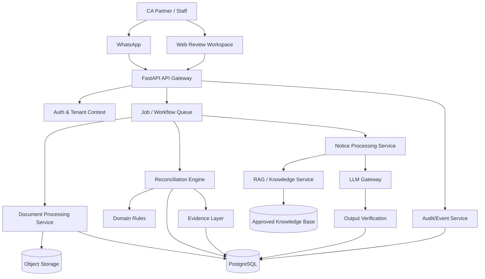

# System Architecture

**Version:** 1.0  
**Status:** Baseline architecture  
**Date:** 24 September 2026

---

# 1. Architecture Objective

Create a modular, tenant-safe system that separates:

1. deterministic compliance processing;
2. document processing;
3. AI reasoning/generation;
4. evidence/provenance;
5. human approval;
6. communication channels.

The architecture must allow model/provider replacement without rewriting the compliance engine.

---

# 2. High-Level Architecture



---

# 3. Architectural Principles

## 3.1 Deterministic core

Financial comparisons and business rules should be deterministic wherever practical.

## 3.2 AI at the uncertainty boundary

Use AI where unstructured language/document interpretation provides value.

## 3.3 Evidence is a first-class object

Evidence is not just a UI link. It must be represented in the data model.

## 3.4 Human approval is explicit

Approval must be an auditable state transition.

## 3.5 Tenant isolation everywhere

Tenant context must be established before accessing business data.

## 3.6 Async for expensive work

PDF parsing, OCR, reconciliation and LLM generation should run through background jobs where appropriate.

---

# 4. Component Responsibilities

| Component | Responsibility |
|---|---|
| API Gateway | REST API, authentication, request validation |
| Auth/Tenant | Identity, roles, tenant resolution |
| Document Service | File validation, parsing, OCR, extraction |
| Reconciliation Engine | Matching, rules, exception generation |
| Notice Service | Notice extraction and case creation |
| RAG Service | Retrieval from approved sources |
| LLM Gateway | Provider abstraction, structured generation |
| Evidence Service | Source references and provenance |
| Workflow Queue | Async jobs and retries |
| Audit Service | Immutable business event history |
| Web UI | Review, filtering, evidence and approvals |
| WhatsApp Adapter | Message/document intake and command routing |
| PostgreSQL | Application state and metadata |
| Object Storage | Original documents and generated artifacts |

---

# 5. Request Lifecycle

## 5.1 Reconciliation

```text
POST /documents
  ↓
store document
  ↓
create processing job
  ↓
parse/normalize
  ↓
POST /reconciliations
  ↓
match engine
  ↓
exceptions
  ↓
evidence records
  ↓
AI explanation only when requested/needed
  ↓
review
```

## 5.2 Notice

```text
POST /notices
  ↓
store original
  ↓
extract
  ↓
validate extraction
  ↓
retrieve approved sources
  ↓
generate draft
  ↓
verify citations
  ↓
save draft version
  ↓
CA review
```

---

# 6. Reconciliation Engine Architecture

### Matching layers

1. exact normalized key;
2. composite key;
3. controlled fuzzy candidate search;
4. rule-based validation;
5. exception classification.

### Example canonical matching key

```text
supplier_gstin
+
normalized_invoice_number
+
invoice_date
+
amount/tax constraints
```

No single key should be assumed universally correct.

---

# 7. AI Architecture

The application should use an LLM Gateway:

```text
LLM Gateway
 ├── Provider A
 ├── Provider B
 └── Future local/self-hosted model
```

The gateway should expose:

- generate_structured();
- generate_text();
- classify();
- extract();
- explain();
- draft();

Provider-specific code must not leak into domain services.

---

# 8. RAG Architecture

```text
Approved Source
   ↓
Ingest
   ↓
Normalize
   ↓
Chunk
   ↓
Metadata
   ↓
Embedding
   ↓
Vector/keyword index
   ↓
Retriever
   ↓
Reranker (optional)
   ↓
LLM context
   ↓
Citation mapping
```

Each chunk needs source metadata.

Minimum:

```json
{
  "source_id": "src_123",
  "title": "...",
  "source_type": "official",
  "url": "...",
  "version": "...",
  "effective_from": "...",
  "effective_to": null,
  "retrieved_at": "...",
  "content_hash": "..."
}
```

---

# 9. Evidence Architecture

Evidence references must support:

- original document;
- page;
- row;
- field;
- extracted value;
- matching rule;
- knowledge-base chunk;
- user comment.

An explanation should be able to point to evidence without requiring the user to search manually.

---

# 10. Human Approval State Machine

```text
DRAFT
  ↓
READY_FOR_REVIEW
  ↓
IN_REVIEW
 ├── REJECTED → DRAFT
 ├── NEEDS_INFO → WAITING
 └── APPROVED
       ↓
   READY_FOR_EXPORT/ACTION
```

No direct:

```text
AI_GENERATED → EXTERNAL_SUBMISSION
```

transition.

---

# 11. Failure Handling

Every async job should support:

- idempotency key;
- retry count;
- exponential backoff;
- terminal failure state;
- error code;
- human-readable error;
- structured logs.

Never silently retry an operation that can create duplicate external side effects.

---

# 12. Scaling Strategy

Initial scale:

- single application deployment;
- managed PostgreSQL;
- object storage;
- Redis/queue;
- background worker.

Later:

- separate worker pools;
- document processing autoscaling;
- LLM routing;
- read replicas;
- dedicated vector infrastructure;
- event-driven integrations.

Do not prematurely introduce microservices. Start with a modular monolith and extract services only when operational boundaries justify it.

---

# 13. Observability

Track:

- API latency;
- queue wait time;
- job duration;
- parsing failures;
- reconciliation duration;
- LLM latency;
- token usage;
- cost per operation;
- citation verification failures;
- user overrides;
- approval latency;
- external provider errors.

Every AI call should carry:

- tenant ID;
- request ID;
- feature;
- model;
- prompt version;
- schema version;
- latency;
- token/cost metadata where available.

---

# 14. Deployment Topology

```text
Internet
  ↓
HTTPS / Reverse Proxy
  ↓
FastAPI
  ├── PostgreSQL
  ├── Redis
  ├── Object Storage
  └── LLM Provider
       └── RAG/Knowledge Store
```

Production secrets must be injected through environment/secret management.

---

# 15. Architecture Quality Gates

Before production pilot:

- tenant isolation tests pass;
- authentication/authorization tests pass;
- reconciliation benchmark passes defined thresholds;
- citation validation passes;
- audit events are complete;
- backups and restore are tested;
- deletion/retention behavior is tested;
- LLM failures degrade safely.
