# TaxTrace Architecture

## 1. Product boundary

TaxTrace is an evidence-first compliance workflow system.

The architectural invariant is:

```text
AI prepares
   ↓
Evidence explains
   ↓
CA approves
   ↓
Audit trail records
```

## 2. Current workflow

### Reconciliation

```text
Purchase Register / GSTR-2B
        ↓
Document validation
        ↓
Normalization
        ↓
Deterministic reconciliation
        ↓
Exception records + evidence
        ↓
Exception review workspace
        ↓
Human decision
        ↓
Export / follow-up
```

### Notice workflow

```text
Notice input
    ↓
Fact extraction
    ↓
Evidence / knowledge retrieval
    ↓
Grounded draft
    ↓
Missing-information / citation handling
    ↓
Partner / CA approval
    ↓
Audit trail
```

### Follow-up

```text
Exception / Notice
      ↓
Task
      ↓
Owner + due date
      ↓
Lifecycle
      ↓
Dashboard / message draft
```

## 3. Backend layers

The current backend is organized around:

- API routers;
- authentication / permissions;
- SQLAlchemy domain models;
- service modules;
- parsers and normalization;
- reconciliation engine;
- AI provider abstraction;
- notice intelligence;
- knowledge/retrieval interfaces;
- audit logging;
- storage;
- migrations.

Tenant isolation is a cross-cutting invariant: business queries should be scoped to the authenticated firm's tenant.

## 4. Frontend

The frontend is a Next.js 16 / React 19 application with TypeScript, Tailwind CSS, React Query, and Vitest tooling.

The pilot UI includes workflows for reconciliation, exceptions, clients, notices, knowledge, tasks, and settings.

## 5. Database and migrations

The repository contains Alembic migrations and a PostgreSQL-oriented schema. The Stage 6 schema additions include task descriptions, exception/notice foreign keys, and a drafts table.

Migration presence does not by itself prove a production database deployment; deployment hardening remains a separate milestone.

## 6. AI boundary

AI components are provider-agnostic and consume structured evidence. The deterministic reconciliation engine remains the source of financial truth.

AI output must be:

- evidence-grounded;
- structured;
- auditable;
- reviewable;
- subject to human approval where consequential.

## 7. Repository architecture map

The following map is the maintained repository-level view of how the current frontend, platform services, reconciliation workflow, notice/AI workflow, firm workflows, and WhatsApp abstraction connect. File labels are implementation references, not a claim that every boundary is production-hardened.

```mermaid
flowchart TD
  subgraph group_reconcile["Reconciliation"]
    node_document_service["Document handling"]
    node_csv["CSV parser<br/>[csv_parser.py]"]
    node_json["JSON parser<br/>[json_parser.py]"]
    node_normalizer["Transaction normalization<br/>[normalizer.py]"]
    node_recon_service["Reconciliation workflow"]
    node_engine["Deterministic matching<br/>[engine.py]"]
    node_rules["Exception rules<br/>[rules.py]"]
  end

  subgraph group_respond["Notice and AI"]
    node_notice_api["Notice and draft routes<br/>[notices.py]"]
    node_notice_service["Notice workflow<br/>[notice_service.py]"]
    node_extractor["Notice extraction"]
    node_ai_service["AI assistance<br/>[ai_service.py]"]
    node_prompt["Prompt templates"]
    node_provider["AI provider<br/>[provider.py]"]
    node_retrieval["Evidence retrieval"]
    node_knowledge_ingest["Knowledge ingestion<br/>[ingest.py]"]
  end

  subgraph group_workflow["Firm workflows"]
    node_tasks["Task workflows<br/>[task_service.py]"]
    node_communications["Follow-up messages"]
    node_dashboard["Dashboard"]
    node_dashboard_api["Dashboard routes<br/>[dashboard.py]"]
    node_bot["Chat command router<br/>[bot_router.py]"]
    node_channel["Channel adapter<br/>[adapter.py]"]
  end

  subgraph group_platform["Platform services"]
    node_api["FastAPI routes"]
    node_auth["Authentication<br/>[auth.py]"]
    node_database[("Domain database<br/>[database.py]")]
    node_models["Domain records<br/>[models.py]"]
    node_audit["Audit trail<br/>[audit_service.py]"]
  end

  subgraph group_frontend["Review interface"]
    node_frontend_pages["Review pages"]
    node_frontend_api["API client<br/>[api.ts]"]
    node_exceptions_ui["Exception review<br/>[page.tsx]"]
    node_knowledge_ui["Knowledge interface<br/>[page.tsx]"]
    node_notice_ui["Notice review<br/>[page.tsx]"]
  end

  node_ca(("CA staff"))
  node_browser(("Web user"))
  node_whatsapp(("WhatsApp"))

  node_ca -->|"uses"| node_browser
  node_browser -->|"reviews"| node_frontend_pages
  node_frontend_pages -.->|"requests"| node_frontend_api
  node_frontend_api -.->|"calls API"| node_api
  node_api -->|"authenticates"| node_auth
  node_api -->|"uses sessions"| node_database
  node_database -->|"stores records"| node_models
  node_api -->|"delegates"| node_document_service
  node_document_service -.->|"records events"| node_audit
  node_document_service -.->|"parses CSV"| node_csv
  node_document_service -.->|"parses JSON"| node_json
  node_csv -->|"normalizes"| node_normalizer
  node_recon_service -->|"runs matching"| node_engine
  node_engine -->|"normalizes records"| node_normalizer
  node_engine -->|"classifies"| node_rules
  node_recon_service -->|"records outcome"| node_audit
  node_exceptions_ui -.->|"requests review data"| node_frontend_api
  node_notice_api -.->|"delegates"| node_notice_service
  node_notice_service -->|"extracts notice"| node_extractor
  node_notice_service -->|"retrieves evidence"| node_retrieval
  node_notice_service -->|"uses documents"| node_document_service
  node_notice_service -->|"generates drafts"| node_provider
  node_ai_service -->|"formats prompts"| node_prompt
  node_ai_service -->|"requests AI"| node_provider
  node_retrieval -->|"embeds query"| node_provider
  node_knowledge_ingest -->|"embeds content"| node_provider
  node_knowledge_ui -.->|"requests knowledge"| node_frontend_api
  node_notice_ui -.->|"requests drafts"| node_frontend_api
  node_dashboard_api -->|"delegates"| node_dashboard
  node_tasks -.->|"supports follow-up"| node_communications
  node_whatsapp -->|"sends messages"| node_channel
  node_channel -->|"routes messages"| node_bot
  node_bot -->|"explains mismatch"| node_ai_service

  classDef toneNeutral fill:#f8fafc,stroke:#334155,stroke-width:1.5px,color:#0f172a
  classDef toneBlue fill:#dbeafe,stroke:#2563eb,stroke-width:1.5px,color:#172554
  classDef toneAmber fill:#fef3c7,stroke:#d97706,stroke-width:1.5px,color:#78350f
  classDef toneMint fill:#dcfce7,stroke:#16a34a,stroke-width:1.5px,color:#14532d
  classDef toneRose fill:#ffe4e6,stroke:#e11d48,stroke-width:1.5px,color:#881337
  classDef toneIndigo fill:#e0e7ff,stroke:#4f46e5,stroke-width:1.5px,color:#312e81
  class node_document_service,node_csv,node_json,node_normalizer,node_recon_service,node_engine,node_rules,node_browser toneBlue
  class node_notice_api,node_notice_service,node_extractor,node_ai_service,node_prompt,node_provider,node_retrieval,node_knowledge_ingest toneAmber
  class node_tasks,node_communications,node_dashboard,node_dashboard_api,node_bot,node_channel toneMint
  class node_api,node_auth,node_database,node_models,node_audit toneRose
  class node_frontend_pages,node_frontend_api,node_exceptions_ui,node_knowledge_ui,node_notice_ui,node_ca,node_whatsapp toneIndigo
```





## 8. Production boundary

The pilot-ready milestone does **not** equal production readiness.

Production still requires external security review, staging deployment, observability, backup/restore validation, production AI-provider controls, and operational hardening.
